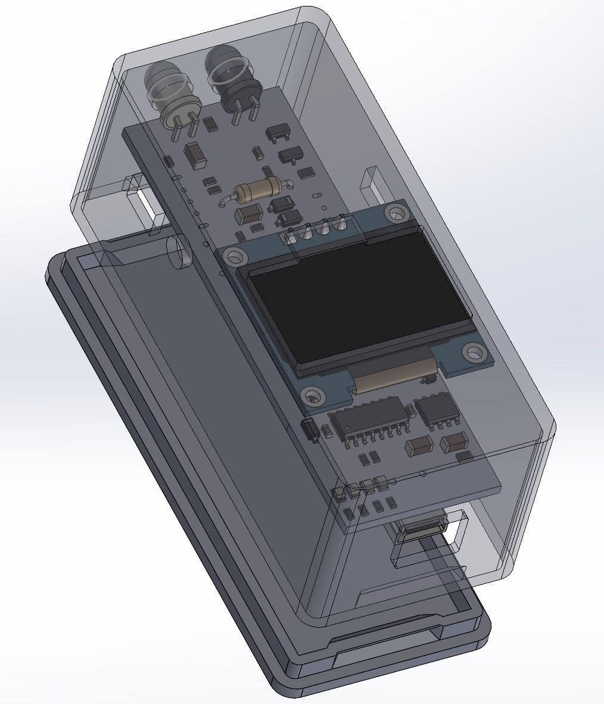

# RPM counter CAD

The case design for this project was based on Adafruits fantastic [Snap-fit case design Fusion360 tutorial](https://youtu.be/VVmOtM60VWw).

The design employs a snap-fit case with holes for the LEDs, OLED screen, switches, USB connector and room for the LiPo battery.