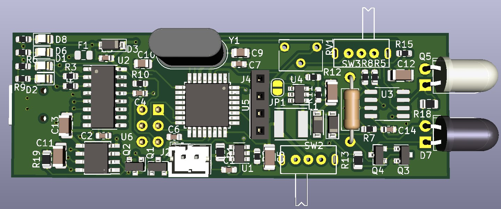

# RPM counter Electronics

This folder contains the schematic, BOM, KiCad files and gerber fabrication files for the PCB.

## Main features:

* ATMEGA328P Microcontroller with Arduino bootloader
* Built-in CH340 based USB <-> Serial
* Constant current IR LED driver
* Runs on single-cell LiPo
  * TP4560 based LiPo battery charger
  * LiPo protection circuitry
  * 3.3 V -> 5 V boost converter